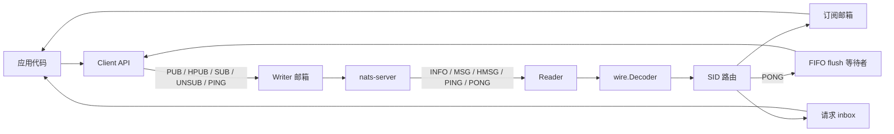

# Moon NATS Link

Moon NATS Link 是用 MoonBit 编写的 Core NATS 客户端。协议内核把 TCP 分块还原为二进制安全的 `MSG/HMSG`，native 客户端再用一条连接承载发布订阅、队列任务和请求应答。



## 第一个请求应答

先在 Linux 或 macOS 启动 `nats-server v2.14.6`：

```bash
nats-server -p 4222
```

另开终端运行请求应答示例：

```bash
moon run src/examples/request_reply --target native
```

```text
request/reply ok: headers + 503 no responders + timeout
```

这个示例先订阅 `rpc.echo`，携带 `Trace-Id` 发出请求，再从随机 reply inbox 收到带 `Handled-By` 的响应。随后它请求一个无人订阅的 subject，确认服务端 503 被映射为 `NoResponders`；最后让一个已订阅的处理者保持沉默，确认 120 ms 后得到 `Timeout`，并完成 inbox 取消与 flush 屏障。

每次请求使用 12 个系统随机字节形成 inbox 前缀，再附加连接内递增序号。reply SID 在发布前发送 `UNSUB sid 1`，因此服务器只会投递第一份响应。

## 两种消息分发方式

`event_fanout` 在同一连接上建立精确订阅 `events.binary` 和通配订阅 `events.*`，随后发布 `00 0d 0a ff`。payload 中间的 CRLF 不会被误认成协议边界，两份订阅各收到一份内容相同的消息。

```bash
moon run src/examples/event_fanout --target native
```

```text
event fanout ok: 00 0d 0a ff reached both subscriptions
```

`queue_workers` 为 `jobs.build` 建立两个同名为 `workers` 的队列订阅。服务端从组内选择一个成员交付 `task-a`，示例通过并发等待两个邮箱来接收被选中的那一份，不假定成员之间存在固定轮转顺序。

```bash
moon run src/examples/queue_workers --target native
```

```text
queue group ok: one worker claimed task-a
```

## 一条连接中发生的事

连接先读取 `INFO`，发出启用 headers 与 No Responders 的 `CONNECT`，再用一次 `PING/PONG` 确认握手写入已经到达服务器。token 或用户名/密码由 `Options::new` 单独接收，只进入 CONNECT JSON，不拼进服务器地址；两种认证不能混用，缺少一半用户名密码也会在连接前被拒绝。服务端在握手阶段返回的授权错误会收敛为 `AuthenticationFailed`。`with_client` 随后启动唯一的 reader 和 writer；发布、订阅、取消与 PONG 响应都经过 writer 邮箱。

TLS 不提供跳过验证的开关。`TlsOptions::new("nats.internal", ca_file="certs/root.pem")` 会以给定名称校验证书，并只信任这份 PEM 中的根；省略 `ca_file` 时使用系统根证书。默认保持 NATS 的 INFO-first 升级顺序，连接 `handshake_first: true` 的服务器时显式传入同名选项。TCP 地址、证书名称和信任根分别保存，认证信息不会借 TLS 配置回到地址字符串。

`wire.Decoder` 在控制行状态和定长 body 状态之间切换。`HMSG` 的 header length 切出完整 `NATS/1.0` header block，total length 决定 payload 终点；消息体不会经过 UTF-8 转换。客户端解析 header 时保留字段大小写、重复值与到达顺序，并拒绝 CRLF 注入或非 ASCII 字段。

每个订阅最多积压 1024 条消息或 8 MiB 的消息体；HMSG 的原始 header block 也计入字节上限。超限的 SID 关闭为 `SlowConsumer`，writer 发送 `UNSUB` 并等待后续 `PONG` 再清理路由，其余 SID 不会被这个慢订阅卡住。

`Client::flush` 将等待者排入 FIFO 队列后发送 `PING`，reader 收到相应的 `PONG` 才唤醒等待者。普通 `unsubscribe` 在调用时立即关闭本地投递，再由 writer 原子排入 `UNSUB + PING`；SID 暂留在路由表中吸收在途消息，后续 PONG 才把它移除。`Subscription::drain` 在 PONG 前仍接纳消息；消费者处理完最后一条消息，再由下一次 `next` 观察 `SubscriptionClosed` 并完成 drain。两种协议动作都由 writer/reader 持有，即使调用任务被取消也能完成 SID 收尾。

`Client::drain` 先禁止新订阅和 request，批量收束活跃 SID；这个阶段仍允许消费者发布最后的响应。所有消费者观察到邮箱关闭后进入发布收尾，再跨一次 PING/PONG 屏障并关闭所有客户端操作。由于客户端提供的是拉取式邮箱，仍有积压时需要另一个任务持续调用 `Subscription::next`，直到得到 `SubscriptionClosed`。

只观察握手时序可以运行：

```bash
moon run src/examples/handshake --target native
```

```text
handshake ok: INFO -> CONNECT -> PING/PONG
```

连接与邮箱之间更细的所有权取舍记录在 [一条连接里的消息时序](docs/connection-lifecycle.md)。

## 互操作与协议测试

```bash
moon fmt --check
moon check src/wire --target all --deny-warn --warn-list +73
moon test src/wire --target all --deny-warn --warn-list +73
moon check src/client --target native --deny-warn --warn-list +73
moon test src/client --target native --deny-warn --warn-list +73
```

2026-09-11 使用 MoonBit `0.1.20260904` 在 wasm、wasm-gc、js、native 四个后端分别运行 22 个 `wire` 测试；Ubuntu 24.04 WSL 使用同版工具链运行 28 个 native 客户端测试。两组测试全部通过。邮箱测试覆盖消息条数、HMSG 字节计数、读取后的配额归还、慢 SID 隔离和 PONG 后的路由清理；CONNECT 编码测试也覆盖凭据中的引号、反斜线与 CRLF。客户端连接校验过 SHA-256 的官方 `nats-server v2.14.6` 后，实际完成二进制扇出、队列领取、带 headers 的 request/reply、503 No Responders、超时清理、flush 与 unsubscribe；连续发布 1025 条未消费消息时也实际得到 `SlowConsumer`，随后另一 SID 仍能收到消息。两个受保护实例分别验证过 token 和用户名/密码，正确凭据完成二进制发布订阅，错误 token 与错误密码均返回 `AuthenticationFailed`。drain 探针进一步确认单订阅收尾后连接仍可复用，整连接收尾会交付 PONG 前的最后一条消息并拒绝后续发布。

2026-09-12 新增的 3 个 TLS 选项测试使 native 客户端测试增至 31 个。使用同一份校验过 SHA-256 的 `nats-server v2.14.6` 发布包生成一张带 `localhost` SAN 的临时自签证书，并把它作为自定义信任根后，INFO-first 与 TLS-first 两种服务端配置都完成了 `00 0d 0a ff` 发布订阅；把校验名称改为 `wrong.example` 时，握手被拒绝并返回 `TlsHandshakeFailed`。

## License

Apache-2.0
